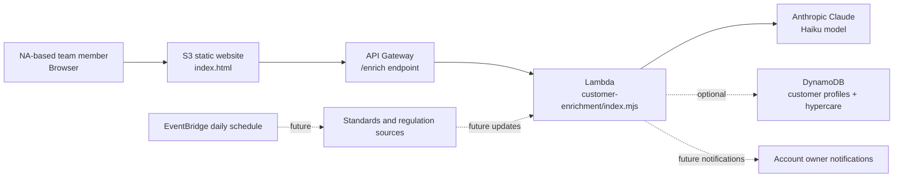

# Assurance Intelligence Hub

Static demo site and backend starter for a TÜV Rheinland-inspired customer and compliance intelligence tool.

## Current site

This project contains a single-page static website in `index.html`. The page is designed to be uploaded directly to an Amazon S3 bucket and served with S3 Static Website Hosting.

The page now includes a customer lookup and enrichment workflow:

- resolve a customer name and confirm ambiguous entities
- enrich customer metadata such as website, headquarters, sector, size, markets, and summary
- infer likely standards and compliance exposure
- save customers into a browser-based demo list
- keep hypercare customers attached to standards for future change notifications
- generate top engagement, cross-sell, and upsell ideas

## Architecture

The live demo page is static, but the intended production setup keeps AI keys and customer data on the AWS side:

In this setup:

- S3 hosts the public website.
- API Gateway provides an HTTPS endpoint for the page to call.
- Lambda runs the customer enrichment logic and calls Claude from the server side.
- DynamoDB can store customer profiles, enrichment runs, standards links, and hypercare records.
- EventBridge can later run a daily standards/regulations change check.

This keeps AI keys out of the browser and gives the team a path toward a proper shared database.

The live page still works without the backend by using browser demo enrichment. That is useful for demos, but saved data stays in the user's browser until the backend and database are connected.

## Customer enrichment backend

A starter Lambda lives in `api/customer-enrichment/`.

The Lambda supports Claude first, OpenAI as an optional fallback, and deterministic demo enrichment if no AI key is configured.

Recommended Lambda environment variables for Claude:

- `ANTHROPIC_API_KEY`: Claude API key. Keep this only in Lambda, never in the website.
- `ANTHROPIC_MODEL`: `claude-3-5-haiku-20241022`.
- `ALLOWED_ORIGIN`: `*` for early testing, or the S3 website URL for tighter access later.

Optional Lambda environment variables:

- `OPENAI_API_KEY`: optional fallback OpenAI API key. If no AI key is set, the Lambda returns deterministic demo enrichment.
- `OPENAI_MODEL`: optional OpenAI model override.
- `CUSTOMER_TABLE`: optional DynamoDB table name for saving enrichment results.

After the Lambda is deployed behind API Gateway, paste the API endpoint into the "AI Backend Setup" section of the page. The browser will call the AWS backend first and fall back to demo enrichment if the endpoint is unavailable.

## AWS setup checklist

1. Host `index.html` in the S3 static website bucket.
2. Create a Lambda function with Node.js and paste in `api/customer-enrichment/index.mjs`.
3. Set the Lambda environment variables for Claude.
4. Create an API Gateway HTTP API route such as `POST /enrich`.
5. Connect that route to the Lambda function.
6. Copy the API Gateway invoke URL into the website's "AI Backend Setup" field.
7. Test a customer lookup from the website.

## Automatic AWS deployment

This repo includes a GitHub Actions workflow at `.github/workflows/deploy-s3.yml`.

After the GitHub repository has the required secrets, every push to `main` will automatically upload the static site files to the S3 bucket.

Required GitHub repository secrets:

- `AWS_ACCESS_KEY_ID`
- `AWS_SECRET_ACCESS_KEY`
- `AWS_REGION`
- `S3_BUCKET`

For the current demo bucket, the values are expected to be:

- `AWS_REGION`: `us-east-1`
- `S3_BUCKET`: `nfecke-demo-page-2026`

The AWS user or role behind the access key needs permission to list the bucket, upload objects, delete old objects, and set object content in the S3 website bucket.

The deploy workflow excludes `.github`, `README.md`, and `api` so backend source files are not uploaded as public website files.

## Standards change watch

The repo also includes `.github/workflows/standards-change-watch.yml`, scheduled for a daily run. It is currently a scaffold: the next production step is to connect official standards/regulatory sources, compare detected changes against the standards linked to hypercare customers, and notify the responsible account owner.

The current static page stores prototype additions in the browser with local storage. A production version should move standards, customers, hypercare links, enrichment audit runs, and notifications into DynamoDB or another backend database.
