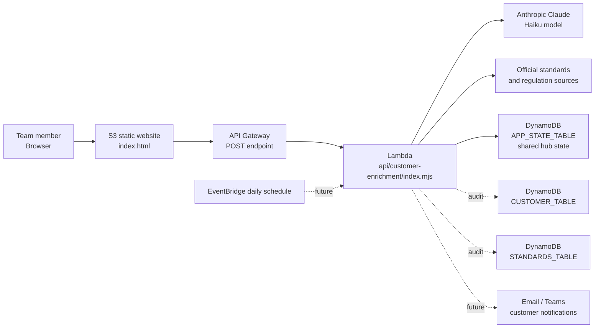

# Assurance Intelligence Hub

Static frontend and AWS backend starter for the TRNA Assurance Intelligence Hub.

## Current Site

This project contains a single-page website in `index.html`. The page can be uploaded directly to an Amazon S3 bucket and served with S3 Static Website Hosting.

The hub is intended to help NA-based team members work with global customers:

- enrich customer profiles through the AWS AI backend
- save customer metadata, standards exposure, project history, impact reviews, and notification tasks
- keep a standards library with official source links and last-change notes
- review which customers are tied to which standards
- create customer notification tasks when a standard or regulation changes

Customer data is no longer seeded with fake saved records. The browser keeps a temporary local cache so the page can render quickly, but shared records should be loaded and saved through the AWS backend.

## Architecture

In this setup:

- S3 hosts the public website.
- API Gateway provides the HTTPS endpoint the page calls.
- Lambda runs customer enrichment, standards source checks, and app-state load/save.
- `APP_STATE_TABLE` is the shared database for the hub state: customers, standards, users, admin requests, impact reviews, tasks, and schedule settings.
- Optional audit tables can store individual enrichment runs and standards source-review history.
- EventBridge can later call the same Lambda daily for scheduled standards/regulations checks.

## Lambda Environment Variables

Required for usable AI enrichment:

- `ANTHROPIC_API_KEY`: Claude API key. Keep this only in Lambda, never in the website.
- `ANTHROPIC_MODEL`: recommended value `claude-3-5-haiku-20241022`.
- `ALLOWED_ORIGIN`: `*` for early testing, or the S3 website URL for tighter access later.

Required for shared hub storage:

- `APP_STATE_TABLE`: DynamoDB table name used for shared app data.

Create the DynamoDB table with a string partition key named `pk` and a string sort key named `sk`. The Lambda stores the current shared hub state at `APP#assurance-intelligence-hub` / `STATE#current`.

Optional:

- `CUSTOMER_TABLE`: DynamoDB table name for customer enrichment audit records.
- `STANDARDS_TABLE`: DynamoDB table name for standards source-review audit records.
- `OPENAI_API_KEY`: optional fallback OpenAI API key.
- `OPENAI_MODEL`: optional OpenAI model override.
- `STANDARDS_BATCH_SIZE`: optional number of standards to check per run. Default is `6`, maximum is `12`.
- `SOURCE_FETCH_TIMEOUT_MS`: optional source page fetch timeout. Default is `9000`.
- `SOURCE_EXTRACT_CHARS`: optional max characters from each source page sent to AI. Default is `5000`.

If `APP_STATE_TABLE` is missing, the website can still test AI enrichment, but it will report that shared storage is not connected. Do not treat browser cache as production storage.

## Backend Request Types

The Lambda supports these task types through the same API Gateway endpoint:

- Customer enrichment: send a customer payload with `name`, optional hints, and `standards`.
- Standards enrichment: send `{ "task": "standards-update", "standards": [...] }`.
- Backend health check: send `{ "task": "health-check" }`.
- Shared state load: send `{ "task": "state-load" }`.
- Shared state save: send `{ "task": "state-save", "state": { ... } }`.

Customer enrichment should return AI-backed profile data. If Claude or OpenAI is missing or failing, the Lambda returns a rule-based fallback with low confidence. The website blocks saving that fallback profile so unknown website, headquarters, employee count, or revenue estimates are not mistaken for confirmed customer intelligence.

## AWS Setup Checklist

1. Host `index.html` in the S3 static website bucket.
2. Create a Lambda function with Node.js and paste in `api/customer-enrichment/index.mjs`.
3. Set the Lambda environment variables for Claude.
4. Create a DynamoDB table for shared state and set `APP_STATE_TABLE` to that table name.
5. Create an API Gateway HTTP API route such as `POST /enrich`.
6. Connect that route to the Lambda function.
7. Copy the API Gateway invoke URL into the website Settings section.
8. Test the saved endpoint from the website.
9. Add a customer and confirm it persists after refreshing or opening the site from another browser.

## API Gateway Trigger

The repo includes `aws/api-gateway-trigger.yml`, a CloudFormation starter that creates:

- an HTTP API
- a `POST /enrich` route
- a Lambda proxy integration
- the Lambda invoke permission that makes the API Gateway trigger appear on the Lambda function
- an output URL to paste into the website

Manual console path:

1. Open the Lambda function.
2. Choose **Add trigger**.
3. Select **API Gateway**.
4. Choose **Create a new API**.
5. Choose **HTTP API**.
6. Use open access for the first test only.
7. Save the trigger.
8. Copy the API endpoint.
9. Paste the final HTTPS URL into the site's Settings field.

## Automatic AWS Deployment

This repo includes a GitHub Actions workflow at `.github/workflows/deploy-s3.yml`.

After the GitHub repository has the required secrets, every push to `main` will automatically upload the static site files to the S3 bucket.

Required GitHub repository secrets:

- `AWS_ACCESS_KEY_ID`
- `AWS_SECRET_ACCESS_KEY`
- `AWS_REGION`
- `S3_BUCKET`

For the current bucket, the expected values are:

- `AWS_REGION`: `us-east-1`
- `S3_BUCKET`: `nfecke-demo-page-2026`

The AWS user or role behind the access key needs permission to list the bucket, upload objects, delete old objects, and set object content in the S3 website bucket.

The deploy workflow excludes `.github`, `README.md`, `api`, and `aws` so backend source and infrastructure templates are not uploaded as public website files.

## Standards Change Watch

The repo also includes `.github/workflows/standards-change-watch.yml`, scheduled for a daily run. It is currently a scaffold: the next production step is to call the deployed API endpoint with the saved standards list, compare returned source-review notes against watched customers, and notify the responsible account owner.
